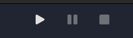
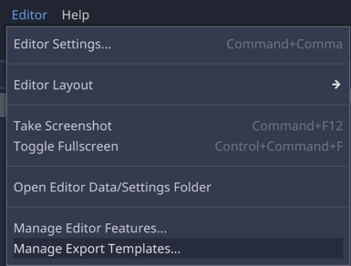
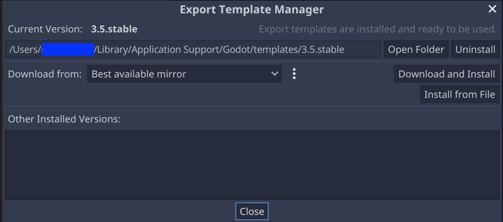
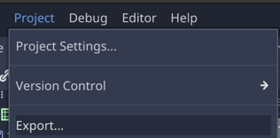
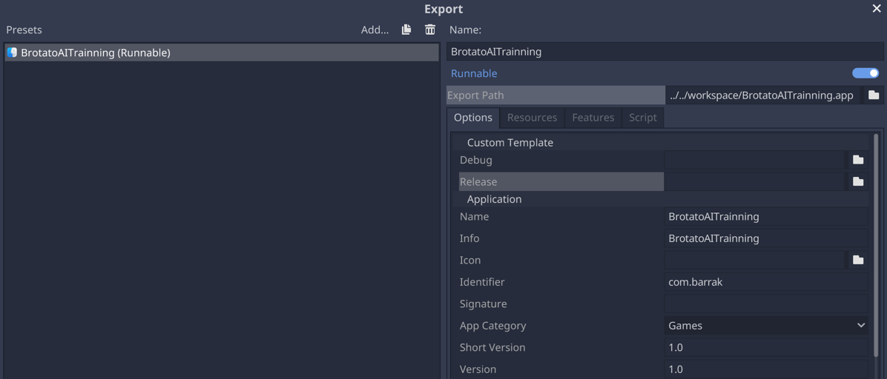

# BrotatoAI
BrotatoAI is a mod for the game Brotato that rely on AI model to play the game.

It's strongly inspired from the work of https://github.com/boardengineer/botato and rely on https://github.com/BrotatoMods/Brotato-Mod-Options for customizations.

This uses an RL PPO stable baseline3 model (or onnx version) accessed through python script to play the game.

# Install Environment (Optional)

## Quick Start
```bash
./tools/install_workspace.sh
```

## Manual Install

### SteamCMD
Download from https://developer.valvesoftware.com/wiki/SteamCMD

### Brotato
Download brotato from steam using steamcmd.

```bash
./steamcmd.sh +@sSteamCmdForcePlatformType windows +force_install_dir ./brotato/ +login <your_brotato_steam_account> +app_update 1942280 validate +quit
```
### Godot RE
Download brotato Reverse Engineering tool from https://github.com/bruvzg/gdsdecomp/releases

Reverse godot pckg file using godot re.

Copy <steam_binary_folder>/steam_data.json to <godot_re_extracted_folder>/extracted folder.

### GodotSteam Editor
Download godot editor from https://github.com/GodotSteam/GodotSteam/releases/tag/v3.25

### Follow guide if necessary

https://steamcommunity.com/sharedfiles/filedetails/?id=2931079751

### Brotato ModLoader

https://github.com/GodotModding/godot-mod-loader

# Run the game from Godot editor

### GodotSteam Editor
Download godot editor from https://github.com/GodotSteam/GodotSteam/releases/tag/v3.25

Open **src/brotato_sources** in Godot editor.

Click on play button, on the top right of the editor.



Then run the backend.

# Run python RL backend

### Prerequisites
```bash
python -m venv brotato_env

pip install -r src/godot_rl/requirements.txt
```

## Run learning from godot editor
```bash
python src/godot_rl/run_from_editor.py
```

## Run learning from godot binaries

### Prerequisites

1. Install export libraries


Click "Download and Install" 

2. Create export template in godot editor


Take care to name it BrotatAITraining

```bash
./tools/export_game_runtime.sh
```


